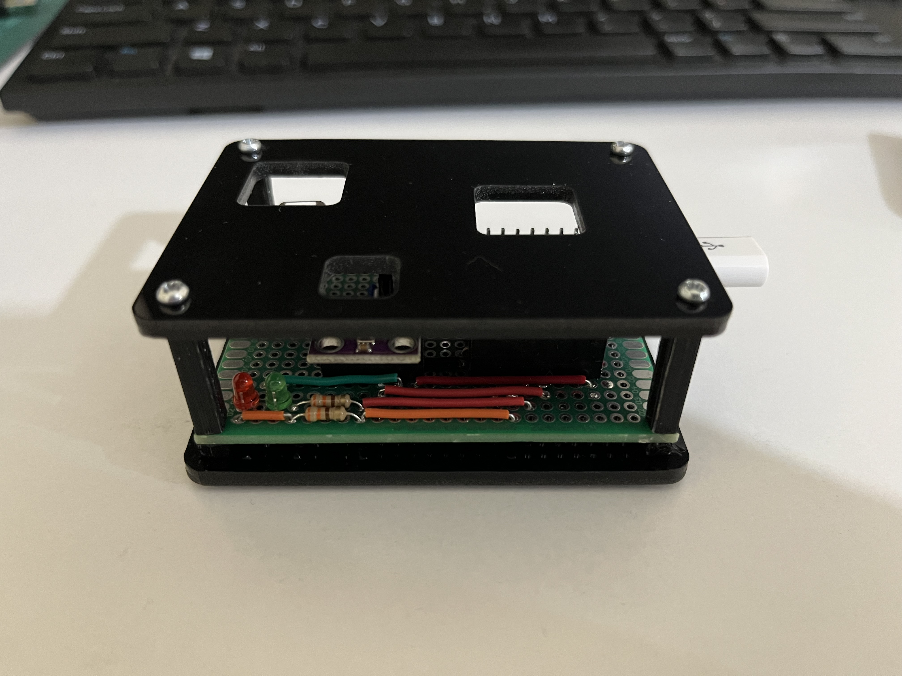
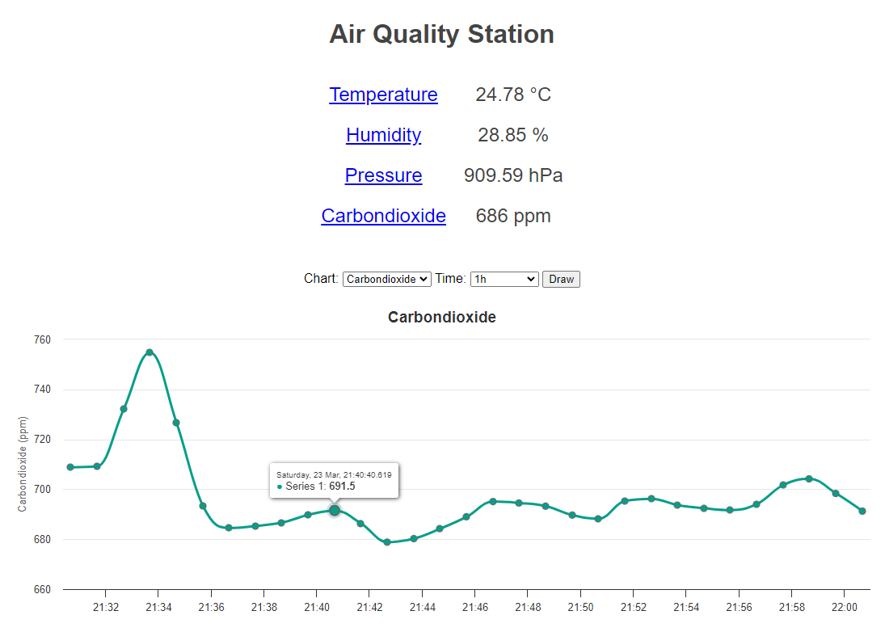

# air-quality
It is an indoor air quality monitoring and logging device that measures temperature, humidity, pressure, and carbondioxide to determine when ventilation is needed for maintaining good indoor air quality.

## Components
- Wemos S2 mini
- BME280
- SCD40
- Leds (Green and Red)
- 330ohm Resistors

  
   
  

